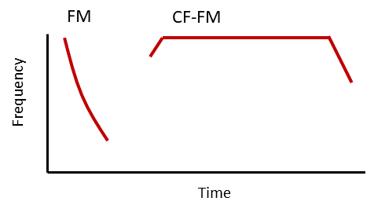

--- 
title: "Theoretical and empirical investigation of echolocation in bat groups"
author: "Thejasvi Beleyur"
date: "$`r Sys.Date()`$"
site: bookdown::bookdown_site
documentclass: book
bibliography: ["beleyur-goerlitz-2020-refs.bib", "tacost-references.bib","cotdoa-filtered.bib","intro-discussion-refs.bib","itsfm-references.bib","ushichka-refs.bib","hbc-references.bib"]
biblio-style: apalike
link-citations: true
description: "A thesis" 
output:
  bookdown::pdf_book:
    latex_engine: lualatex
    includes:
      in_header: preamble.tex
geometry: a4paper
always_allow_html: true
---
```{r, include=FALSE, echo=FALSE}
options(tinytex.verbose = TRUE)
library(knitr)

# escaping special characters page:
# https://en.wikibooks.org/wiki/LaTeX/Special_Characters

```

# Summary {-#summary}

Animals in groups gain a variety of advantages from their membership. Group membership also simultaneously comes with a variety of costs. From a sensory perspective being part of a group challenges the individual sensory system with the multitude of signals to be dealt with. Much work has gone into understanding how passive sensing animals that act as 'receivers' of signals (eg. vision and audition), manage the sensory challenge of groups. Multiple passive sensing animals may perceive their environment and signals in it without majorly affecting the perception of their neighbour. Active sensing animals in contrast emit probes of energy to detect their surroundings. In active sensing groups, it is expected that group-members will mutually interfere, or jam each other's sensory systems. Echolocating bats emit intense calls, and use the returning echoes to detect their surroundings. In groups, due to mutual jamming, individual bats are expected to suffer a severe drop in echo-detection. Despite this expectation, echolocating bats are very gregarious, and show impressive collective behaviours. In this thesis I investigate how active sensing echolocating bats manage to echolocate in groups using a combination of computational simulations and field studies, while also contributing to the methods that ease acoustic tracking and the analysis of echolocation calls.  

In Chapter \@ref(cpnchapter), I quantify the sensory challenge of group echolocation. In groups, the returning echoes of each bat will be overlapped by the intense calls and echoes of their neighbours. I estimate the detriment in echo detection that bats may experience with increasing group size using computational simulations. I build an experimentally parametrised model implementing details of bat audition, sound propagation and group geometry. I find that bats may still be detecting echoes in group sizes of up to a hundred. Bats in such large groups however may be detecting only one neighbour occasionally once every three calls. The model assumed a simplified auditory system, and thus represents a lower-bound for echo detection. My model represents the first attempt at a biologically parametrised model of group echolocation. The results raise the question about the severity of group echolocation and estimates the sensory input available for collective motion in bat aggregations. 

Chapter \@ref(hbcchapter) is an observational study in the field looking into the echolocation of high duty-cycle bats in groups. High duty-cycle bats emit long calls with short pauses in between. Their long calls and frequent call emission increases the likelihood of call-echo overlaps even in small groups. Due to the challenge of analysing overlapping calls, not much work has been done studying high duty-cycle bat groups, and have primarily been in flightroom conditions. Using audio and video recordings of free-flying bats in a cave, I analyse the difference in echolocation when high duty-cycle bats fly alone and when in groups of upto four bats. I develop a package to automate the segmentation and measurent of individual calls into their component parts (described in Chapter \@ref(itsfmchapter)). I also develop a method to analyse audio with overlapping calls and use it in conjunction with simulations to understand if bats alter their echolocation in groups. The results suggest no major changes in call parameters between solitary and group-flying bats. The study contributes know-how in the analysis of overlapping calls and automation of individual call analysis. The study highlights the robustness of bat echolocation, and stresses the importance of field studies to characterise the capabilities of active sensing animals. 

From high duty-cycle bats, Chapter \@ref(ushichkachapter) reports the details of another observational study looking at group echolocation in free-flying low duty-cycle bats. Low duty-cycle bats emit short calls with long silences in between. Despite the punctuated calling behaviour of low duty-cycle bats, results from modelling in Chapter \@ref(cpnchapter) show that echo detection can already be affected from group sizes of 30 bats onwards. I present the methods and investigative potential behind what I call the *Ushichka* dataset. *Ushichka* is a multi-channel, multi-sensor dataset of *Myotis myotis* and *Myotis blythii* bats echolocating over a range of group sizes between 1-~30 in a cave chamber. The dataset consists of synchronised microphone and thermal-camera arrays, along with a LiDAR scan of the cave chamber. The microphone arrays capture the call emissions, while camera arrays capture flight trajectories. The LiDAR scan provides a contextual 3D record of the volume. Given the position, call emission and LiDAR data, we can for the first time reconstruct the sensory inputs of individual bats in groups to great accuracy. Analysing multi-bat audio brings its own challenges such as call overlaps and multi-channel correspondence. However, it is my opinion that the observed group sizes of upto ~30 bats corresponds to a 'Goldilocks' zone, where current methods may perform satisfactory acoustic tracking. Unlike comparable studies, *Ushichka*, is to my knowledge, the first such dataset to record the collective behaviour of bats in the wild with multiple sensors simultaneously.

Chapter \@ref(sfscotdoa) marks the beginning of a series of methodological reports contributing to the study of group echolocation. Multi-microphone arrays are central to studies of echolocation. Arrays provide access to the 3D position of the calling bat, but also add to the logistical effort during field work. Most arrays consist of microphones placed on bulky frames that are difficult to carry. Their typically rectilinear forms stand out in natural settings and may result in artifactual inspection behaviours by the animals themselves. In place of frames, placing microphones freely in the field also brings the burden of having to measure microphone positions each time. In Chapter \@ref(sfscotdoa) I present the results of a collaboration towards a frame-less, measurement-free approach to acoustic tracking. The workflow involves freely placing microphones and recording a series of common sounds on all channels. The time-differences-of-arrival between channels are then used to estimate microphone positions automatically. In this report we show the sucessful estimation of freely-placed microphones in a cave setting to within $\pm$ 4cm of ground-truthed measurements. This is the first time such a  methodology has been applied in the field of echolocation, and it promises to expand the freedom and scale of multi-microphone arrays under field and laboratory settings.  

The accuracy of acoustic tracking is affected by a host of factors such as array geometry, source sound type and location of sound emission. When designing a microphone array from scratch, or when characterising an array post-hoc, it is important to understand the baseline accuracy the system will show. Chapter \@ref(tacostchapter) presents the ```tacost``` software package that generates simulated multi-channel audio according to user-specified scenarios. While ```tacost``` does not perform acoustic tracking itself, it generates the simulated data to allow the user to compare the consequences of various design decisions. ```tacost``` is a tool to assist the optimisation of acoustic tracking systems during the conception phase, and post-hoc analysis after recordings have been performed. 

The echolocation call is a common sensory 'unit' for investigations. The acoustic parameters of a call and its spectro-temporal structure are tightly linked with the behaviour at hand. Common approaches to measure echolocation calls include using automated inhouse-scripts or manual measurements. Inhouse-scripts suffer from a lack of public scrutiny, while manual measurements are biased and do not scale well with sample size. In Chapter \@ref(itsfmchapter), I present the ```itsfm``` software package to automate the segmentation and measurement of echolocation calls. I implement a commonly described method to segment CF-FM calls, along with introducing a new algorithm. The new algorithm is consistently more accurate at segmentation than the commonly described method.  Even though originally developed for the analysis of CF-FM calls, the routines in ```itsfm``` are also of interest for bioacousticians at large.

In conclusion, I briefly describe key findings and outline my vision of future research based on the three-pronged approach to study active sensing in groups. The three-pronged approach consists of 1) advancing techniques to aid field studies and analysis of audio with overlapping calls, 2) conducting controlled experiments to better estimate the sensory abilities of individuals and 3) using the collected data from field studies and controlled experiments to generate and parametrise computational models. This thesis provides a glimpse of the advancements that the three-pronged approach can provide to active sensing with its contributions to computational modelling, field observations and new techniques. 


\newpage

# Zusammenfassung {-#zusammenf}

In Gruppen lebende Tiere profitieren von Vorteilen, müssen allerdings auch mit Herausforderungen umgehen. Aus Sicht der Sinneswahrnehmung für das Einzeltier besteht zum Bespiel die Herausforderung spezifische Signale aus einer Vielzahl an Signalen zu verarbeiten. Es ist bereits sehr gut untersucht, wie Tiere welche ihre Umwelt mit passiven Sinnen erfahren (wie zum Beispiel das Sehen oder Hören), also lediglich Signale „empfangen“, mit der Vielzahl an Signalen in Gruppen umgehen. Bei vielen dieser Tiere beeinflusst die eigene Wahrnehmung von Signalen die Wahrnehmung der benachbarten Tiere nicht. Im Gegensatz dazu gibt es Tiere welche ihre Umwelt über aktive Sinne erfahren, hierbei senden die Tiere aktiv Energie aus um damit ihre Umgebung „abzutasten“. Wenn solche Tiere Gruppen bilden wird erwartet, dass sich die von ihnen ausgesendete Energie gegenseitig beeinträchtigt und somit ihre Sinneswahrnehmung beeinflusst oder sogar überschreibt. Trotz der Möglichkeit dieser Überschreibung von Signalen, kommt soziales Verhalten und Gruppenaufkommen in Tieren mit aktiver Sinneswahrnehmung häufig vor. In dieser Thesis erforsche ich, wie Tiere mit aktiver Sinneswahrnehmung, echoortende Fledermäuse, es schaffen ihre Sinneswahrnehmung in Gruppen aufrechtzuerhalten. Dabei verwende ich eine Kombination aus Computersimulation und Feldstudien und trage mit Methoden bei, welche das akustische Verfolgen und die Analyse von Echoortungsrufen erleichtern. 

Im Kapitel \@ref(cpnchapter) quantifiziere ich die sensorische Herausforderung von Echoortung in Gruppen. In Gruppen werden informationsreiche Echos von den Rufen und Echos umliegender Fledermäuse überschrieben. Diese Überschreibung, auch „jamming“ genannt, steigt vermutlich in einer nicht linearen Weise mit ansteigender Gruppengröße. Trotz dieser Annahme bilden freilebende Fledermäuse Gruppen von mehreren tausend Individuen. Um diese Beeinträchtigung von Echowahrnehmung abschätzen zu können benutze ich Computersimulationen. Ich generierte ein Model, dessen Parameter auf experimentelle Daten basierte und berücksichtigte die Funktion des Fledermausgehörs, Schallausbreitung und Gruppengeometrie. Meine Resultate zeigen, dass Fledermäuse vermutlich immer noch in der Lage sind ihre eigenen Echos zu empfangen, selbst bei Gruppengrößen von hunderten von Tieren. Fledermäuse in solch großen Gruppen detektieren bei jedem dritten Ruf allerdings nur noch einen ihrer umliegenden Nachbarn bzw. das von Nachbarn zurückgeworfene Echo. Das Model berücksichtigt eine vereinfachte Version des auditorischen Systems und spiegelt deshalb eine Untergrenze der Echowahrnehmung wieder. Mein Model repräsentiert den ersten Ansatz eines biologisch parametrisierten Models von Echoortung in Gruppen. Die Ergebnisse werfen die Frage der Beeinträchtigung von Echoortung in Gruppen auf und schätzen die sensorische Information ab, welche in kollektive fliegenden Fledermausgruppen für das Einzeltier zur Verfügung steht. 

Kapitel \@ref(hbcchapter) handelt von einer Beobachtungstudie im Feld, welche die Echoortung von Fledermäusen mit einem sogenannten hohen „duty-cycle“ über verschiedene Gruppengrößen untersucht. Fledermäusen mit einem hohen duty cycle senden relative lange Rufe mit kurzen Pausen dazwischen aus. Ihre langen Rufe und die hohe Ruffrequenz erhöhen das Risiko der Überlappung von Rufen und Echos, selbst in kleineren Gruppen. Da die Analyse von solch überlappenden Rufen sehr herausfordernd ist, wurden Fledermäuse mit diesem Ruftyp bisher nur wenig und wenn dann im geschlossenen Flugraum untersucht. Mit Hilfe von Audio- und Videoaufnahmen von freifliegenden Fledermäusen in Höhlen, analysiere ich den Unterschied in Echoortung zwischen alleine fliegenden Tieren und Tieren in Gruppen von bis zu vier Individuen. Ich entwickelte ein Programmpaket um die Segmentierung und Messung von einzelnen Komponenten individueller Rufe zu automatisieren (beschrieben in Kapitel \@ref(itsfmchapter)). Ebenso entwickelte ich eine Methode zur Analyse von Audioaufnahmen mit überlappenden Rufen und benutzte sie in Verknüpfung mit Simulationen um besser zu verstehen, ob und wie Fledermäuse ihr Rufverhalten in Gruppen anpassen. Die Ergebnisse suggerieren keine maßgeblichen Veränderungen des Echoortungsverhaltens zwischen alleine und in Gruppen fliegenden Tiere. Die Studie trägt damit zu den Analysen von überlappenden Rufen und der Automatisierung von Einzel-Rufanalysen bei. Die Studie betont die Robustheit von Echoortung in Fledermäusen und hebt dabei die Wichtigkeit von Feldstudien hervor um die Fähigkeiten von Tieren mit aktiver Sinneswahrnehmung zu beschreiben. 

In Kapitel \@ref(ushichkachapter) untersuchte ich einen in der Orlova Chuka Höhle erhobenen Langzeitdatensatz um das Gruppenechoortungsverhalten in freifliegenden Fledermäusen mit niedrigem duty cycle zu verstehen. Fledermäuse mit niedrigem duty cycle senden kurze Rufe mit langen Pausen dazwischen aus. Trotz der verhältnismäßig geringen Rufrate dieser Fledermäuse, zeigten Ergebnisse der Modellierung in Kapitel \@ref(cpnchapter) eine Beeinträchtigung von Echo-Wahrnehmung bereits bei einer Gruppengröße von 30 Tieren. Hier präsentiere ich die Methode und das investigative Potential dieses „Uchichka“ Datensatzes. „Uchichka“ ist ein multi-Kanal, multi-Sensor Datensatz vom Echoortungsverhalten von Myotis myotis und Myotis blythii Fledermäusen, bei wechselnder Gruppengröße von 1-30 Tieren in einer separaten Kammer der Höhle. Die Daten wurden mit Hilfe von synchronisierten Mikrophonen und Wärmebildkamera-Arrays aufgenommen, verknüpft mit einem LiDAR-Scan der Höhlenkammer. Die Microphon-Arrays nahmen die Rufemission auf, die Kamera-Arrays die Flugbahnen der Tiere. Der LiDAR-Scan unterstützt mit einer kontextuellen 3D-Aufnhamen des Volumens der Kammer, in welchem sich die Tiere aufgehalten haben. Aufgrund von bekannter Position der Tiere, Rufemission und LiDAR-Daten können wir zum ersten Mal den jeweiligen sensorischen Input von einzelnen Tieren in einer Gruppe rekonstruieren indem wir die Schallausbreitung simulieren. Um solche Audioaufnahmen von mehreren Tieren analysieren zu können müssen Herausforderungen wie Rufüberlappung und multi-Kanal-Übereinstimmung überwunden werden. Meiner Meinung nach können derzeitige Analysemethoden allerdings zufriedenstellende Ergebnisse in der akustischen Verfolgung liefern, wenn die Gruppengrößen, wie in der hier beobachteten Gruppe, eine Anzahl von 30 Tieren nicht übersteigt. Ungleich anderer Studien ist „Ushichka“, meines Wissens nach, der erste Datensatz welcher das kollektive Verhalten von Fledermäusen in freier Natur mit Zuhilfenahme von verschiedenen, zeitgleich eingesetzten Sensoren aufnimmt.

Kapitel \@ref(sfscotdoa) markiert den Beginn einer Serie von Methodenbeschreibungen, welche zur Studie von Echoortung in Gruppen beitragen, hierbei sind Multi-Mikrophon-Arrays zentral zu nennen. Akustische Arrays liefern die 3D-Position von rufenden Fledermäusen, tragen aber auch erheblich zum logistischen Aufwand von Feldstudien bei. Die meisten Arrays bestehen aus Mikrophonen welche auf unhandlichen Rahmen platziert wurden und daher schwer zu transportieren sind. Ihre typische rechtwinklige Konstruktion sticht aus natürlichen Umgebungen hervor und resultiert in unnatürlichem Inspektionsverhalten der Tiere. Im Gegensatz zu solchen Arrays, können Mikrophone auch frei im Feld platziert werden, deren Position muss dabei aber jedes Mal exakt ausgemessen und festgehalten werden. In Kapitel \@ref(sfscotdoa) präsentiere ich die Ergebnisse einer Kollaboration deren Ziel es war eine rahmenlose und mit wenig Messaufwand verbundenen Methode zum akustischen Verfolgen von Fledermäusen zu entwickeln. Der Workflow schließt dabei das freie Platzieren von Mikrophonen und das Aufnehmen von bekannten Tönen mit allen Kanälen ein. Die „time-difference-of-arrival“ wischen Kanälen werden dann genutzt um die Mikrophonposition automatisch abzuschätzen. In unserem Bericht zeigen wir eine erfolgreiche Positionsabschätzung von frei platzierten Mikrophonen in einer Höhle mit einer Genauigkeit von $\pm$ 4cm. Dies ist das erste Mal, dass eine solche Methode im Feld der Echoortung angewandt wurde und verspricht damit eine Zunahme an Freiheit und Größenmaßstab für zukünftige Multi-Mikrophon-Arrays im Feld und Labor. Sobald Bioakustiker von der Last der Mikrophon-Rahmen befreit wurden, und damit auch der logistische Aufwand minimiert wurde, können natürliche Strukturen genutzt werden um großflächige, unauffällige Arrays zu installieren. 
Die Genauigkeit des akustischen Verfolgens ist beeinflusst von einer Vielzahl an Faktoren, so wie die Array-Geometrie, als auch dem Typ und der Lage der gemessenen Schallquelle. Daher ist es wichtig, beim grundlegenden Konstruieren aber auch beim nachträglichen Vermessen von Arrays, die Grundgenauigkeit eines solchen Systems zu verstehen. Kapitel \@(tacostchapter) präsentiert das „tacost“ Programmpaket, welches multi-Kanal-Audioaufnahmen simuliert, basierend auf die vom Benutzer festgelegten Array-Parameter. Während „tacost“ zwar kein akustisches Verfolgen an sich ausführt, generierte es Daten um dem Nutzer zu erlauben die Konsequenzen von verschiedenen Array-Konstruktionsentscheidungen zu vergleichen. „tacost“ ist ein Werkzeug um die Optimierung eines Tracking-Systems in der konzeptionellen Phase als auch die post-hoc Analyse nach der Aufnahme zu erleichtern. Das Paket wurde mit open-source Lizenz und Onlinedokumentation veröffentlicht. 

Der Echoortungsruf ist eine vielstudierte, sensorische „Einheit“. Die akustischen Parameter des Rufs (Länge, Bandbreite) und seine Struktur (Frequenzmodulation) sind eng mit dem damit verbundenen Verhalten verknüpft. Verbreitete Herangehensweisen um solche Rufe zu vermessen beinhalten automatisierte, eigenangefertigte Skripte oder manuelle Vermessung. Eigenangefertigte Skripte erfahren oft keine ausreichende öffentliche Kontrolle, wohingegen manuelle Vermessungen, gerade bei großen Datenmengen, sehr zeitaufwendig sind. In Kapitel \@ref(itsfmchapter) präsentiere ich das “itsfm” Softwarepaket, welches die Einteilung und Vermessung von Echoortungsrufen automatisiert. Ich realisiere damit eine verbreitete Methode der Segmentierung von CF-FM rufen kombiniert mit einem neuen Algorithmus. Dieser neue Algorithmus liefert mit hoher Beständigkeit eine höhere Genauigkeit der Segmentierung als gewöhnlich beschriebene Methoden. Obgleich entwickelt für die Analyse von CF-FM Rufen, können die Routinen in „itsfm“ von einer breiten Anwendung in der bioakustischen Szene sein. Das Paket wurde mit open-source Lizenz und Onlinedokumentation veröffentlicht.

Abschließend möchte ich kurz die Schlüsselerkenntnisse beschreiben und einen Ausblick auf zukünftige Wissenschaft geben, welche den dreigleisigen Ansatz zum Studieren von Tieren mit aktiver Sinneswahrnehmung in Gruppen berücksichtigt. Dieser dreigleisige Ansatz besteht aus 1) Verbessern der Techniken um einfache Datenaufnahme im Feld und die Analyse von Audioaufnahme mit überlappenden Rufen zu vereinfachen, 2) Ausführen von kontrollierten Experimenten um die sensorischen Fähigkeiten von einzelnen Individuen besser zu verstehen, 3) Nutzen der gesammelten Daten von Feldstudien und kontrollierten Experimenten um Computermodelle zu generieren und zu parametrisieren. Diese Thesis liefert einen ersten Einblick, welche Verbesserungen der dreigleisige Ansatz durch Beiträge in Form von Computermodellen, Feldbeobachtungen und neuen Technologien im Feld der Studie von aktiver Sinneswahrnehmung bewirken kann.

\newpage 
 
 \
 \
 \
 \
 \

*Bulla! I know not who I am,*

*Bulla! I know not who I am*

...

*Nor am I the believer in the mosque,*

*Nor am I in the rituals of the infidel,*

*Nor am I the pure in the impure,*

*Nor am I inherent in the Vedas*

...

*Nor am I of the water nor of the land,*

*Nor am I fire nor air,*

*Bulla! I know not who I am,*

*Nor am I Arabic nor from Lahore,*

...

*Nor did I name myself,*

*Beginning or end I know just the self,*

*Do not acknowledge duality,*

*There's none wiser than I*\


*Who is this Bulla Shah?*\

*Bulla! I know not who I am,*

*Bulla! I know not who I am*

 - Bulla Shah, Sufi mystic and poet ^[I interpret this poem as an apt expression of the simultaneous pleasure, confusion and contentment gained from inter-disciplinary research]. Translation by @bullashahtransl.

*Echolocation is still a topic that resists neat classification into any conventional category of science. It ramifies into widely different scientific disciplines including ethology, mammalogy, physiology, psychology, acoustics, and the mathematical theory of signal detectionl. The results of new investigations have reemphasized the necessity of a broad biological perspective for any serious appreciation of echolocation.*

 - Donald Griffin, Listening in the Dark

\newpage

# General Introduction 

Animals in groups balance the advantages and disadvantages of their membership. A few advantages of being in a group include increased foraging success, lower predation risk and better thermoregulation. The disadvantages however also include experiencing increased competition for resources, along with increased disease transmission [@davies2012introduction]. The overall benefits  group living and selection pressure it exerts is evident by the adaptations social species show. Group living animals show specific adaptations to their social environment, including alterations in their morphology, cognition and sensory systems [@wilson2000sociobiology;@ward2016sociality].  

The social environment of animals in long-term social groups (eusocial insects, mammals) or short-term groups (eg. lekks, maternal colonies) is particularly filled with a continuous stream of multi-modal stimuli and presents a host of challenges that individual sensory systems and behaviours have evolved with. To illustrate this point, we only need to look at ourselves as a species. The sensory challenge of conducting a conversation with a person in the middle of a gathering lies in trying to listen to what the person opposite is saying, and in trying to make ourselves heard. This problem has been termed the 'cocktail party problem' [@cherry1953a] and our own sensory systems and behaviours show a variety of responses to such situations. As 'emitters' of speech we talk louder in the presence of background noise (the Lombard effect, reviewed in @zollinger2011lombard). As 'receivers' there are a host of auditory and attentional processes that come into play. Our pinnae provide directional cues to allowing us to hone into sounds coming from the relevant direction [@yost2007a] while the auditory centers in the brain are able to selectively choose the best speech signals (with the higher signal-to-noise ratio) from either cochlea [@brungart2012better]. Many other taxa such as birds, frogs and crickets face very similar cocktail-party like issues [@bee2008a;@brumm2005a], and show a diversity of strategies to solve the challenges of dealing with emitting and detecting signals that overlap in time and are very similar spectrally. As emitters, animals may attempt to avoid signal overlap wherever possible, for instance in certain species of frogs and crickets, pairs of males may alternate their calls to reduce temporal overlap [@bee2008a;@hartbauer2016rhythm], while in other species males synchronise their calls to increase the conspicuosness of the emitted signal and attract females over a longer distance range [@greenfield2015signal]. As receivers, animals in groups need to be able to identify and separate signal sources and move in response to them. In certain vertebrates such as penguins, bats and seals, young are raised in large maternal colonies. Mothers leave their young ones in these colonies as they go to forage and return afterwards. A common strategy seen for mother-young reunion  is the presence of individual-specific contact calls in either the mother or the pup [@bradbury1998principles]. The task of detecting a pup's or mother's call in the midst of a few hundreds to thousand other individuals' calls is no trivial task, and mistakes do occur. The difficulty of detecting the one 'correct' signal amongst many others is evident by the rate of mother-pup mismatches in a Mexican free-tailed bat colony: 17% of sampled mother-pup pairs were actually not related [@mccracken1984communal] .  

Animal sensory systems are more than static 'receivers' or 'emitters', but exist in a dynamic interaction with the outside world through sensorimotor loops that form the basis of behaviours such as walking, running, flight. Individuals in groups must also deal with the consequences of having conspecifics around even in simple tasks such as movement and path-planning. In contrast to moving in surroundings with stationary objects and predictable trajectories, moving among conspecifics implies anticipating and updating one's own direction of movement constantly. The apparent ease with which individuals in a murmuration of starlings or school of fish move belies the complex underlying sensorimotor loops that drive the movement of each individual in the group. These collective behaviours can be replicated in computational agent-based models with abstract and simple behavioural heuristics based on the relative proximity and position of each agent's neighbours [@reynolds1987a;@couzin2002a]. The behavioural heuristics in these models mimics what animals in a group are likely to be doing [@herbert2016understanding], and broadly consists of the following cycle: 1) the individual assessing the relative position and movement direction of its neighbours, 2) using a decision criterion to integrate information on the neighbour positions and movements and 3) moving in a direction using the integrated information. 

A key step in the initiation and maintenance of any collective behaviour is neighbour detection through the sensory modalities available to the animal. Many of the collective movements studied experimentally to date have been in visually dominant animals [@pita2016collective] such as birds, fish, mammals and flies. The fact that each animal acts as an independent receiver of light, and does not affect the amount of light received by others majorly (aside from light obstruction due to body opacity) means that visually driven collective behaviour can scale well with group size. Given sufficient ambient light, individuals in all sizes of groups (small to large) are expected to independently be able to detect their neighbour's and thus show co-ordinated movement. This expectation is supported by experimental observations of thousand strong starling flocks [@ballerini2008a], schools with ten-hundreds of fish [@tunstrom2013collective], or even humans as we aggregate in small to very large groups [@moussaid2011simple;@dyer2009leadership]. Concrete support for the use of visual cues, and their role in modulating individual decisions in group movement is provided by studies that reconstruct individual sensory *umwelts* [@turner2002encoding;@strandburg2013visual;@belden2019vision]. In contrast to simple models that assume all neighbours in a fixed sensory volume can be detected [@reynolds1987a;@couzin2002a], sensory reconstruction approaches include the details of neighbour positions and visual acuity [@strandburg2013visual;@belden2019vision], and thus allow a detailed analysis of individual sensory inputs and motor outputs. 


## Active sensing in groups : a tricky proposition
Broadly classified, sensory systems are of two types: passive and active. Passive sensing systems such as vision and olfaction are receivers that 'take in' stimuli from the environment. Active sensing animals such as bats, cetaceans, cave swiftlets and weakly electric fish(sensu strictu @nelson2006a) emit pulses of energy and perceive the environment through modulations of this pulse. In this respect, active sensing differs from passive sensing as animals generate carry their own 'flashlamps' to sense the world around them. The fact that animals must constantly emit pulses of energy to detect their surroundings raises cocktail-party like problems for individuals in groups. Electric fish detect objects through fluctuations they cause in the electric field along their body [@heiligenberg2012principles]. When multiple electric fish are in close proximity, they will mutually disrupt each other's ability to detect objects due to the similarity in the emitted electric field properties of individuals [@nelson2006a]. This mutual disruption has been termed 'jamming', inspired by the technical term used in RADAR. Jamming is a phenomenon expected in all active sensing animals irrespective of the type of energy that forms the probe (sound or electric field).

In the face of jamming from other active sensing conspecifics and experimental treatments, individuals show 'jamming-avoidance responses' [@watanabe1963change;@bullock1972jamming]. The jamming avoidance response was coined and reported first reported in weakly electric fish (of the Gymnotiformes,Mormyridae families). There are two broad types of weakly electric fish: wave-type and pulse-type. Wave-type electric fish continuously emit electric discharges at an individual-specific frequency. When faced with an experimental signal that is close to their own emitted frequency, wave-type fish  shift their discharge frequency to prevent spectral overlap and thus deterioration in electrolocation. The 'pulse' type electric fish emit short electric discharges at intervals. Pulse type electric fish resort to increasing their discharge rate, or adjusting discharges to avoid overlap with interfering experimental pulses [@heiligenberg2012principles]. Studies of jamming avoidance in electric fish have helped form the first glimpses into how active sensing animals deal with jamming. Early studies primarily focused on individual-level responses to experimental treatments [@heiligenberg2012principles], with recent studies starting to study multiple freely swimming electric fish in the laboratory and field  [@arnegard2005electric;@tan2005electrosensory;@donati2016investigation;@henninger2020tracking]. One factor that may alleviate jamming in weakly electric fish is that the electric fields are fairly localised, with individual electrolocation mostly effective till about one body-length [@nelson2006a]. Individuals may also only detect each other's fields at most only a few body lengths away [@knudsen1975spatial].

What about active sensing animals whose energy probes are much less localised, and thus more likely cause to jamming in groups? Echolocating bats emit intense ultrasonic calls and detect their surroundings by listening for the echoes reflected off objects around them [@griffingalambos1941]. The high intensity calls have a typical source level of around 120 dB (re 20$\mu$Pa) sound pressure level (SPL) at 10cm from the mouth. In audible sound terms, this is the equivalent of being painfully close to a jack hammer in action [@ashawebpage]! Sound intensity drops with distance from the source, and ultrasound in particular faces strong absorption in the atmosphere. Very high source levels ensure that returning echoes will be detectable. Using the auditory cues in the returning echo such as arrival delay, intensity, and spectral content, bats can detect fine details about the distance, shape and size  of obstacles and prey items [@Simmons2014]. The problem of jamming in groups of bats is qualitatively and quantitatively different than in weakly electric fish as the calls and echoes are sound emissions. Sound travels at a speed of around 330m/s (or roughly about 30cm/ms) unlike electric fields that propagate nearly instantaneously at the speed of light. Echoes thus return to a bat with a perceptible delay, during which many other non-relevant sounds may arrive in groups. Sound emission and reception is also far less directional than in electrolocating fish [@nelson2006a]. Individual bats may mask each other's echoes over a distance of tens of metres. 

## Echolocation in individual bats
Echolocation (much like electrolocation) may seem like an odd sensory modality that shares little with what we experiencee as^[apart from the human echolocators amongst us]. In contrast to this 'obvious' intuition, the morphological and physiological basis of hearing in bats is centred around a standard mammalian auditory *bauplan* consisting of a pinna, three ossicles, eardrum, and a cochlea [@neuweiler2000biology]. The sound generation occurs in the larynx in all bats except for two known click-emitting bats that may be generating clicks with their tongue [@fenton2013a]. 

### Bats as emitters {#batemitters}
Broadly speaking bats show two types of echolocation strategies in analogy to those seen in electric fish: low and high duty-cycle echolocation. The duty-cycle is the fraction of time the bat is calling in comparison to the time it is silent ($Duty \:Cycle=\frac{Call\:duration}{Silence}$).Similar to pulse-type fish, low  duty-cycle bats emit short (1 to 20 ms) frequency modulated (FM) sweeps [@fenton2012evolution,@fenton1995natural] with long silences (inter-pulse-intervals)  in between calls with a duty cycle ranging betweeen 5-18% [@fenton2013a] (Figure \@ref(fig:cffmschem)). Like wave-type fish, high duty-cycle bats emit much spend much more of their time emitting calls. High duty-cycle bats emit long calls (~10 to >50 ms) with a 'staple-pin' like shape consisting of an upward FM sweep, followed by a constant frequency (CF) portion, ending with a downward FM sweep (Figure \@ref(fig:cffmschem)). Due to the combination of CF and FM components in the calls, they are also referred to as CF-FM calls. Succesive calls are emitted with small gaps at a much higher duty-cycle between upwards of 30% [@fenton2012evolution]. While call structure (FM/CF-FM) is typical to the two groups, there is great flexibility to the structure too. For instance, CF-FM bats begin to emit short FM type calls as they are about to land, and FM bats are known to emit quasi-CF calls with an initial downward FM sweep turning into a CF portion.

```{r, cffmschem,echo=FALSE, fig.cap='\\label{fig:cffmschem}Schematic spectrogram showing the call structure of the two broad types of echolocators. *Left*: A short duration frequency-modulated (FM) call emitted by a low duty-cycle bat. *Right*: A long duration call with a constant frequency (CF) regions, sandwiched by upward and downward FM regions. The calls are called CF-FM calls.'}


```
As hinted above echolocation is far from a stereotypical behaviour, with bats showing great flexibility in almost all aspects of their calling behaviour. Take the case of a bat initially searching for prey, locating an insect, capturing it and then resuming flight. As it searches for prey initially, a bat will typically emit high source level, narrow bandwidth, long calls (a few ms) with long inter-pulse intervals (~100-200ms). These call parameters optimise long-range object detection. Upon localising an insect and flying closer, it continues to reduce its call duration and inter-pulse interval, till just before the insect capture the emitted calls are fainter , high bandwidth, shorter (~1ms)  and emitted at extremely short inter-pulse-intervals (~5ms). The call parameters in the pre-capture phase are optimised to localise a moving target at close range. The reduced call levels and durations to ensure echoes from background objects do not mask the insect echoes [@Fenton2014]. As we will see later, the flexibility in bat echolocation is key to how they may manage flying in groups.  

### Bats as receivers
While sharing many common features with other mammales, echolocating bats show a series of specific adaptations to their aurally dominated lifestyle. Bat hearing thresholds match those of comparable mammals (and humans) at around 20$\mu$Pa sound pressure level (SPL) [@wahlberg2014sound]. The diverse pinna shapes across bat species contributes to hearing directionality [@obrist1993a], which allows accurate localisation of returning echoes with high angular resolution [@Moss1995]. Like humans, and other mammals , bats too undergo forward, backward and simultaneous masking [@m1989a;@siewert2004a;@suemer2009a]. Forward masking is when a 'louder' sound (the masker) arrives before the echo and affects detection. Backward masking is when the masker arrives *after* the echo and affects masking. Simultaneous masking is when the masker overlaps the echo, and prevents detection. The combination of forward, backward an simultaneous masking means echo detection is affected even when a masking call arrives a few milliseconds before or after the echo too. To combat masking, bats also show another common auditory phenomenon seen in vertebrates - spatial unmasking [@suemer2009a;@geberl2019spatial]. Spatial unmasking is the improvement in echo detection with increasing angular separation between masker and echo (despite temporal overlap). For instance @suemer2009a showed a drop of ~26 dB (around 20 fold drop) in required echo level, with a separation of merely 23$^{\circ}$.  

### Emitter-receiver characteristics 
The combination of call emission and echo reception properties results in the effective 'sensory volume' [@nelson2006a] of a bat. Call intensity is highest in front of the bat, and drops with increasing angles to the side. Hearing directionality broadly follows the same pattern. The combined forward bias of both emission and reception systems means that the strongest echoes will arrive in the front, and their detection will also be emphasised too. The forward bias can also be thought of as a 'de-cluttering' mechanism, which filters out irrelevant echoes coming from non-target objects [@simmons2012biosonar]. 

Bats use their combined emission-reception properties to effectively deal with sensory challenge of flying alone too. Clutter is the term used to describe echoes from background objects that hinder target echo detection. Even when echolocating alone, intense echoes from clutter objects can mask the detection of fainter echoes. For instance, a bat attempting to capture an insect in front of a bush will face the problem of having to detect a faint insect echo that is temporally next to a series of loud echoes from the bush. Bats synergestically combine the properties of their emission-reception characteristics along with flight behaviours to optimise object detection [@yovel2010optimal;@taub2020segregating] under challenging conditions. For instance, bats that needed to land on a target placed in front of a bigger wall approached the target from an angle [@taub2020segregating]. This situation closely mimicked the problem of detecting an insect echo in the face of masking clutter echoes. The angled target approach resulted in most of the call's beam being focussed on the target, with a stronger echo from the object and a weaker clutter echo. 

## Active sensing in noise and groups
The robustness of echolocation to noise was an early point of investigation. @griffinresistance in their paper titled 'The resistance of bats to jamming' attempted to overwhelm *Plecotus townsendii* echolocation with an array of 52 speakers playing noise into the flightroom. @griffinresistance placed thin metal wires into the flightroom and found that the bats were able to succesfully detect and avoid colliding with these wires. Inspired by approaches to RADAR research, @griffinresistance estimated the signal-to-noise ratio (SNR) a bat might experience, and actually found *negative* SNRs (positive and high values of SNR promise reliable results). Noise playbacks are now an established paradigm in the field [@roverud1985discrimination;@m1989a;@jones1994individual;@tressler2009context;@hage2013ambient;@hage2014ambient;@luo2015linking]. One general critcism of noise-based experiments is that the bat auditory system is *not* an electronic sensor where only energy content in a frequency band determines detection. The bat auditory system is capable of discerning the obvious time-frequency structure of an echo from the randomness of ambient noise, and may even be using an efference copy of the emitted call itself as reference [@simmons2012biosonar]. Bats' 'resistance to jamming' however also remains strong even when conspecific calls are played back from all across a flightroom [@amichai2015a]. 

What are the bats doing to improve their echo detection? Flightroom and laboratory experiments with playbacks and conspecifics reveal a wide variety of sometimes contradictory echolocation responses across species. Common responses include calling louder and increasing call durations [@tressler2009a;@m1989a;@amichai2015a;@luo2015linking], reducing call rate [@adams2017a] or altering bandwidth [@hase2016a;@hase2018a;@hage2013ambient]. Bats have been well studied in their role as 'emitters' trying to make the best of a jamming situation. While explanations have been put forward to piece together each species' specific response, a conceptual framework to put together the experience of bats as 'listeners' undergoing jamming remains missing. 

Flightroom experiments can only simulate the jamming severity of group echolocation to an extent, and are no substitute for studying aggregations in the wild. It is difficult to create a uniformly intense sound field in a room, as already observed by @griffinresistance. There will always be local pockets of higher and lower sound levels, that an individual bat can make use of. Placing multiple bats in a flightroom is of course the next closest thing to observing groups in the wild. Using live animals then presents the problem of motivating multiple animals to fly simultaneously- which happens less often as one would wish.  Along with the lack of animals' motivation, experimenter's have avoided studying large groups (>5 bats) due to the technical challenge of analysing overlapping calls. Most studies in the lab and field have been with very small group sizes (2-5 bats) [@jones1994individual;@fawcett2015clutter;@fawcett2015echolocation;@goetze2016a;@adams2017a;@hase2018a]. At such small group sizes, it is questionable whether bats experience jamming at all. Are the reported echolocation behaviours responses to jamming, or responses to another moving object in the room [@@fawcett2015clutter;@fawcett2015echolocation]?. Field observations of larger groups in natural settings have failed to simultaneously capture flight and echolocation behaviour simultaneously [@gillam2010a;@theriault2010a;@cvikel2015a;@lin2016a]. There is still much scope for studies accessing the collective behaviour and group echolocation of large bat groups in the wild. While visually driven collective motion has been investigated in great depth in large groups of fish and birds, the study of active sensing bat groups lags far behind.

## Technology in the study of echolocation
The very discovery of echolocation could only happen because a curious biologist (Donald Griffin) joined a physicist (G.W. Pierce) who had developed an ultrasound detector, and pointed it at the inaudible vocalisations of bats [@griffin1958a]. Without stressing too much on the disciplinary labels of the researchers themselves, the moral of the story is that studying echolocation has always meant closely working with technology and forging inter-disciplinary collaborations. Thankfully technology has moved leaps and bounds since the days of Griffin in the 1950's. Reading an account of Griffin's field work [@griffin1958a] makes one grateful for the multi-functionality of laptops and smartphones. Griffin had to carry oscilloscope, diesel generator, cameras, film rolls, analog tapes and flash lamps to record a few minutes of data in the field. In contrast I've had to carry laptop, digital soundcards and thermal cameras for fieldwork, all of which weigh far less and with the great advantage of being able to record much much more data. 

Some of the challenges still remain the same from Griffin's time onward.  Acoustic tracking of bat calls was first achieved by @aubauer1994dreidimensionale, who used a 4-microphone array. Microphones were placed on a frame, and the time-delays of call arrival between channels were used to triangulate the bat's call position. Since Aubauer's time, multi-microphone arrays have been used to track bats in the lab and field  [@KOBLITZJENSBARBA;@MOSSGHOSE;@holderied;@SIMMONS;@goerlitzpapers]. Acoustic tracking relies on a knowledge of microphone positions, which is achieved by fixing mic positions on frames. The very array-frames that provide stable positions to the microphones are cumbersome especially in the context of fieldwork. Large multi-mic frames need to be carried, assembled, and aligned each time before recordings begin. Animals may inspect these conspicuous objects, instead of showing their regular echolocation behaviour. There is a strong need for flexibility and to do away with microphone array frames based on simple rectilinear geometries.

The positional accuracy of acoustic tracking is dependent on multiple factors such as array geometry, source sound structure and source position. Mathematical derivations of accuracy are intensive and specific to a fixed geometry, as are manual calibration experiments. Estimating tracking accuracy with simulated audio, provides a reliable and fast compromise. Characterising tracking accuracy is important in the planning phase of an experiment, or post-data collection. However, to my knowledge, there are no publicly available tools that allow a user to generate multi-channel data of simulated arrays and sounds.

Aside from the 'hardware' issues of placing and planning microphone arrays, certain issues have also remain in the analysis of echolocation data. Many studies still use manual mesurements. Manual measurements  are intuitive and yet susceptible to bias. For instance, using spectrograms to measure acoustic parameters can lead to experimenter bias and non-reproducible results [@brummspecmanual]. A majority of studies use automated methods to quantify call parameters in the form of inhouse-scripts, whose implementation is only briefly described in the paper. Descriptions are subject to interpretation and description-derived implementations lead to different results [@bakervincent2019;@mcfee2018open]. There is a strong need for a culture of openly shared, documented scripts and packages in echolocation. 


## Thesis outline 
In this thesis I will investigate the sensory  challenge faced by active sensing animals in groups using a combination of experimental and theoretical methods. Through modelling I will reveal and quantify the sensory challenge low duty-cycle FM bats face in groups of various sizes. I will then present the results of an field study detailing the echolocation strategies of high duty-cycle, CF-FM bats in the presence of conspecifics. Continuing my focus on field studies, I then report a novel experimental dataset and workflow to study large groups of echolocating bats in the wild. I will end with a series of methodologically driven reports that significantly reduce the effort needed to perform acoustic tracking at scale, help users characterise their microphone arrays and ease the computational reproduciblity of echolocation call analysis. 

```{r echo=FALSE}
#CPN chapter
```
Echolocation is expected to become increasingly infeasible with growing group sizes due to masking. In response to masking in the form of artificial playbacks and conspecific calls, bats show a variety of changes to their echolocation behaviour. While many experimental studies have reported the changes bats show as 'emitters' of sound, very little focus had been given to date on bats as 'receivers'. Computational work modelling group echolocation has been restricted to models that are qualitatively based on echolocation, with minimal biological details.  In chapter \@ref(cpnchapter) I present an experimentally parameterised computational model that estimates the sensory inputs a bat may receive as it echolocates in a group. By quantifying echo detection from small to large groups. I find that even in group sizes of 200 bats, individuals may still be detecting one neighbour every few calls. When alone, a bat detects echoes reflecting off all objects in its surroundings. In contrast to echolocating when alone, bats in groups thus face a much lower 'update rate' in groups. Despite this lowered sensory update rate, I argue that the detection of occasional echoes may provide the sensory basis for the impressive feats of collective behaviour bats show in roosting sites, mating swarms and emergences. 

Chapter \@ref(hbcchapter) takes us into our first experimental study looking at echolocation in groups of high-duty cycle CF-FM bats. Given their longer calls and higher frequency of call emission, the problem of call-echo overlap in CF-FM bat groups is expected to occur already at small group sizes. The issue of call overlaps is also reflected in the audio recordings, which are technically challenging to analyse. Moreover, the study of CF-FM bats in groups has been limited to pairs of bats in flightrooms, with missing field observations of their group echolocation. I fill the gaps in the field by studying the echolocation of *Rhinolophus mehelyi* and *R. euryale* in a natural cave setting. Having developed methods to systematically analyse CF-FM calls (see Chapter (\@itsfmchapter)), and approaches to analyse audio with overlapping calls, I quantify the group echolocation of CF-FM bats for the first time in group sizes of upto 4 bats. CF-FM bats do not seem to show major alterations in their call parameters when they fly alone or together in cave settings. Our results highlight the robustness of echolocation as a sensory modality. Bats integrate echo information across multiple calls along with using their spatial memory. When flying in familiar natural settings bats may thus tolerate occasional drops in echo detection, and thus not show major changes in echolocation. Here I add a subtle detail that runs counter to the dominant narrative of echolocating showing dramatic changes in response to jamming. 

Emphasising the importance of field studies of active sensing, Chapter \@ref(ushichkachapter) describes the methodology, motivation and investigative potential of a novel multi-channel, multi-sensor dataset. The *Ushichka* dataset as I call it, is a series of multi-night recordings of resident FM bats echolocating in a cave chamber next to the sole exit point of the Orlova Chuka cave system. Bats form aggregations in this chamber in groups of 1-~30, and their flight and echolocation behaviour was recorded at high temporal and spatial resolution. Synchronised microphone and camera array recordings allow reconstruction of flight paths and call behaviour. A LiDAR scan of the cave chamber provides the physical context of the exhibited behaviours. Unlike previous studies that have studied groups of bats in the field using either acoustic or 3D video tracking, *Ushichka* is one of its kind in capturing group echolocation with multiple sensors. *Ushichka* opens doors to reconstructing the dynamic sensory inputs of each bat as it flies in the chamber. *Ushichka* adds a unique multi-sensor perspective to collective behaviour in active sensing animals, by providing not only the kinematics, but also insight into the sensory bases of collective movement in bats. 

Chapter \@ref(sfscotdoa) describes a methodology to automatically infer microphone positions in an acoustic array. While rewarding in terms of the data it generates, the process of setting up a microphone array can be strenuous especially when it comes to taking positional measurements. The use of TotalStation surveying systems that provide direct XYZ measurements are not common in the field (they are themselves another piece of bulky equipment). In contrast to acoustic arrays, camera arrays are much easier to setup and calibrate. Field-friendly protocols like @Theriault2014 mean the field biologist may freely place the cameras, record animal activity and then perform calibrations by moving a common object in front of the cameras. Trying to move away from arrays on frames, I found the work of @zhayida2016automatic  with their 'Structure-From-Sound' method. @zhayida2016automatic were able to automatically infer microphone positions using only the common sounds recorded across channels as input. I was able to initiate a collaboration with Prof. Åström (Uni. Lund) and convey my enthusiasm for their method when applied to our arrays in the field. This chapter with Prof. Åström and colleagues shows the viability of automatic microphone position estimation in field conditions, using recordings I made in the Orlova Chuka cave (during *Ushichka* fieldwork described in Chapter \@ref(ushichkachapter)). This chapter is but a beginning to the development of field-friendly workflows in acoustic tracking. The 'Structure-From-Sound' method used in this chapter and @zhayida2016automatic promise to significantly reduce the barrier to multi-microphone acoustic tracking for bioacousticians. For one it completely eliminates the need to place microphones in specific geometries on conspicuous bulky frames and secondly, there will be no more need to perform tedious measurements before or after recordings. Being able to handle a larger number of microphones, the bioacoustician will be free to generate even higher resolution measurements of animal sounds. 

In Chapter \@ref(tacostchapter) I present the ```tacost``` software package to aid the design and analysis of acoustic tracking systems. The accuracy of acoustic tracking is affected by multiple parameters, eg. the array geometry, source sound position and signal-to-noise ratios. Experimental calibration of tracking system accuracy is time and labour intensive, while mathematical analysis of accuracy are restricted to specific array geometries. Simulated audio data presents a quick and simple method to estimating the performance of acoustic tracking systems either before or after experiments. ```tacost``` generates multi-channel audio data according to user-specified array-related parameters. ```tacost``` can be used to plan array geometry to optimise tracking accuracy before experiments, or post-hoc to estimate the accuracy of the tracking system used. I detail the use of ```tacost``` to estimate patterns in tracking accuracy with two types of experimentally used array systems, the planar 'tristar' array, and an array configuration used in Chapter \@ref(ushichkachapter) & \@ref(sfscotdoa) with freely-placed microphones spread around a volume. While ```tacost``` does not itself perform any acoustic tracking, it serves as a useful tool to estimate baseline performance. The package is written in the non-proprietary Python language, and released with an open-source license. To ease its use, the package also has detailed online and offline documentation.

In Chapter \@ref(itsfmchapter), I present the ```itsfm``` software package originally written to perform systematic and reproducible analysis of CF-FM echolocation calls detailed in Chapter \@ref(hbcchapter). CF-FM calls appear like staple-pins when viewed on a spectrogram. The 'rising' and 'declining' portions form the frequency-modulated (FM) parts, while the flat portion, forms the constant-frequency (CF) portion (Figure \@ref(fig:cffmschem)). The two call portions serve different sensory functions, and can be altered independently. To date, studies have adopted a variety of automated and manual methods to segment and then quantify the alterations in the CF and FM call portions. Manual methods of call segmentation are not reproducible and suscept to experimenter bias, while the automated software based methods remain custom scripts with sparse descriptions. Publicly available implementations are important for the scrutiny and comparison of published methods. Purely description based implementations can show important differences from original implementations. Additionally, none of the software based methods include assessments of segmentation accuracy. ```itsfm``` implements a commonly described method (that I call the *peak-percentage* method) to segment CF-FM calls, and introduces a new and more reliable method (the *pwvd* method) to segment CF-FM calls. I also create a synthetic dataset of CF-FM calls, and compare the performance of the *peak-percentage* and *pwvd* algorithms in their segmentation accuracy. Results show that the *pwvd* method is overall superior to the *peak-percentage* method, and is thus the recommended algorithm to use for segmenting CF-FM calls. The *pwvd* method, unlike the *peak-percentage* method, is also potentially applicable to vocalisations of any kind as it does not rely on a specific spectro-temporal shape assumption. The ```itsfm``` package is written in the non-proprietary Python language, and released with an open-source license. To ease its use and encourage the further development of the package, detailed online and offline documentation has been made available.